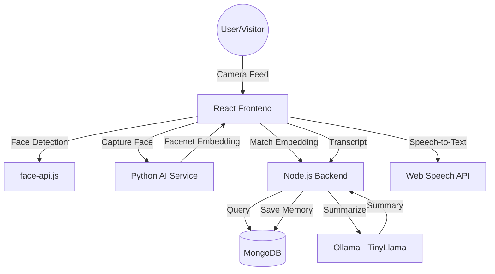

# RememberMee 🧠

**RememberMee** is an AI-powered assistant designed to support individuals with dementia and memory loss. By leveraging real-time face recognition and conversation summarization, it helps users recognize visitors, recall past interactions, and maintain social connections.

---

## 🚀 Overview

The system acts as a "digital companion" in the living room. When a visitor enters, the system:
1.  **Identifies** the person using a camera feed.
2.  **Retrieves** the last recorded memory or relationship context.
3.  **Transcribes** the live conversation.
4.  **Summarizes** the interaction into a concise memory snippet.
5.  **Archives** the memory for future recognition.

---

## 🏗️ Architecture

The project follows a modular architecture combining a web interface, a robust backend, and specialized AI services.

### System Diagram


---

## 🤖 AI Models & Technologies

### 1. Face Detection & Recognition
*   **face-api.js (TinyFaceDetector):** Used in the frontend for real-time face tracking and drawing bounding boxes on the camera feed.
*   **DeepFace (Facenet):** A Python-based service handles the heavy lifting of generating 128-dimensional facial embeddings using the **Facenet** model. This ensures high accuracy even with variations in lighting and angles.

### 2. Conversation & Summarization
*   **Web Speech API:** Utilized for real-time Speech-to-Text (STT) conversion within the browser.
*   **Ollama (TinyLlama):** An locally-hosted Large Language Model (LLM) that processes raw conversation transcripts. It filters out "small talk" and generates 1-2 sentence "Memory Reminders" focusing on the core topics discussed.

---

## 📂 Project Structure

```text
RememberMee/
├── ai-services/            # Python FastAPI service for Face Embeddings
│   ├── main.py             # Entry point for DeepFace logic
│   └── requirements.txt    # Python dependencies
├── backend/                # Node.js Express server
│   ├── controllers/        # Business logic (Memories, Auth, Context)
│   ├── models/             # Mongoose Schemas (User, Memory)
│   ├── routes/             # API Endpoints
│   └── index.js            # Server entry point
├── frontend/               # React Vite application
│   ├── src/
│   │   ├── pages/          # LivingRoom, VisitorArchive, Auth
│   │   ├── components/     # UI Components (Sidebar, Navbar)
│   │   └── App.jsx         # Routing logic
│   └── public/             # Static assets (Face-api models)
└── README.md               # You are here!
```

---

## 🛠️ Tech Stack

*   **Frontend:** React (Vite), Tailwind CSS, GSAP (Animations), Lucide Icons.
*   **Backend:** Node.js, Express.
*   **Database:** MongoDB, Mongoose.
*   **AI:** Python, FastAPI, DeepFace, face-api.js.
*   **Local LLM:** Ollama (TinyLlama).

---

## 🔧 Installation & Setup

### Prerequisites
*   Node.js (v18+)
*   Python 3.10+
*   MongoDB
*   [Ollama](https://ollama.com/) (installed and running `ollama run tinyllama`)

### 1. Setup AI Service
```bash
cd ai-services
python -m venv venv
source venv/bin/activate  # or venv\Scripts\activate on Windows
pip install -r requirements.txt
python main.py
```

### 2. Setup Backend
```bash
cd backend
npm install
# Create a .env file with MONGO_URI and JWT_SECRET
npm start
```

### 3. Setup Frontend
```bash
cd frontend
npm install
npm run dev
```

---

## 🌟 Key Features

*   **Zero-Touch Recognition:** Automatically detects and greets known visitors.
*   **New Visitor Onboarding:** Easy form to register new faces with their relationship.
*   **Smart Summaries:** LLM-powered reminders that focus on *what* was talked about, not just *that* you talked.
*   **Visitor Archive:** A beautiful bento-grid interface to browse all past visitors and memories.
*   **Privacy First:** All AI processing (Face recognition and LLM summarization) can be run locally.

---

## 📜 License
This project is part of a Capstone Project for Semester 1, MCA.
